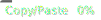

<!-- vale Microsoft.HeadingColons = NO -->
# Clean User Manager: usermgr
<!-- vale Microsoft.HeadingColons = YES -->

[](https://github.com/haru52/clean-user-manager/actions/workflows/test.yml)
[](https://github.com/haru52/clean-user-manager/actions/workflows/release.yml)
[](https://github.com/haru52/clean-user-manager/actions/workflows/codeql-analysis.yml)
[](report/jscpd-report.md)
[](https://haru52.github.io/clean-user-manager/CODE_OF_CONDUCT.html)
[](https://commitizen.github.io/cz-cli/)
[](https://github.com/semantic-release/semantic-release)

## Overview

CLI of a user management system. This is an example TypeScript project of [Clean Architecture](https://blog.cleancoder.com/uncle-bob/2012/08/13/the-clean-architecture.html).

## Requirements

| Tool            | Version                                          |
| --------------- | ------------------------------------------------ |
| Node.js and npm | `engines` values in [package.json](package.json) |

## Installation

```sh
npm i -g @haru52/usermgr
```

## Usage

```console
Usage: usermgr [options] [command]

CLI of a user management system. This is an example TypeScript project of Clean Architecture.

Options:
  -V, --version    output the version number
  -h, --help       display help for command

Commands:
  register <name>  register a new user
  show <id>        show the user
  help [command]   display help for command
```

<!-- vale Microsoft.Foreign = NO -->
`usermgr` command generates or updates `.usermgr/usermgr.db` file in your home directory. This is an SQLite DB file. If you want to clean this DB, please delete this DB file (e.g., Run `$ rm "$HOME"/.usermgr/usermgr.db`).
<!-- vale Microsoft.Foreign = YES -->

## Update

```sh
npm i -g @haru52/usermgr
```

## Uninstall

```sh
npm r -g @haru52/usermgr
rm -rf "$HOME"/.usermgr
```

## Versioning policy

[Semantic Versioning 2.0.0](https://semver.org/spec/v2.0.0.html)

## License

[WTFPL](LICENSE)

## Contributing

[Contributing Guideline](https://haru52.github.io/clean-user-manager/CONTRIBUTING.html)

## Documentation

[Documentation | clean-user-manager](https://haru52.github.io/clean-user-manager/)

## References

- [Clean Coder Blog](https://blog.cleancoder.com/uncle-bob/2012/08/13/the-clean-architecture.html)
- [Clean Architecture - アスキードワンゴ](https://asciidwango.jp/post/176293765750/clean-architecture)
- [実践クリーンアーキテクチャ │ nrslib](https://nrslib.com/clean-architecture/)
- [Javaでクリーンアーキテクチャする方法　Part.1:ヘキサゴナルアーキテクチャ - ログミーTech](https://logmi.jp/tech/articles/323233)

<!-- vale Microsoft.Vocab = NO -->
## Author
<!-- vale Microsoft.Vocab = YES -->

[haru](https://haru52.com/)
